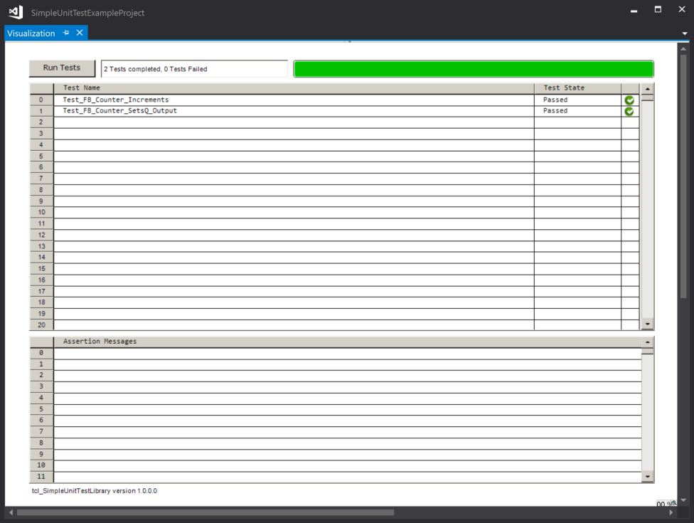

# SimpleUnitTestLibrary example project

This project was created with TwinCAT 3.1.4024.7

The easiest way to install the libraries is to right-click on the PLC object in the project tree and select "Install Project Libraries (Unknown ersions)"

This should install
* tcl_SimpleUnitTestLibrary version 1.0.0.0
* tcl_StringUtils version 1.0.4.0

The project should then build and run, producing the following output:

